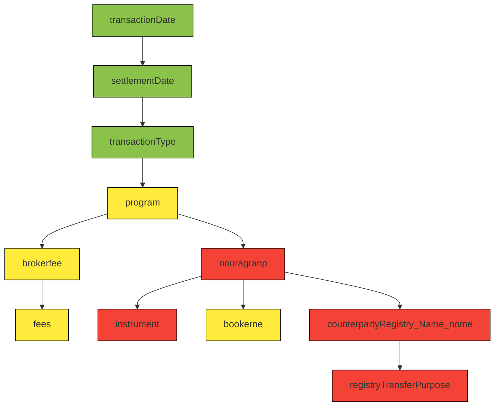

	## `BilateralTransactionCommand`

### Validations list via Grails constrains
1. `transactionDate` You must give me a transaction date. And don’t try to sneak in a date from the future (timezone **America/New_York**).
2. `liabilityType` and `liabilityId` must either both be set OR both be null.
3. `settlementDate` nullable: false  
4. `transactionTypeId` nullable: false
5. `quantity` validator:
	1. Quantity cannot be null
	2. Quantity must be at least 1 (so no zeros or negative numbers)
6. `price` validator:
		1. Skip validation if transaction type is EXPORT
	1. No price object at all or it’s some custom Money wrapper where value is null (it is required)
	2. Currency missing → return `"null currency"`
	3. Price must be positive → `"positive.notmet"`
	4. Cap the price using a global validator → `"max.transaction.quantity.exceeded"`
7. `instrument` validator:
	1. Cannot be null.
	2. Must be an active instrument.
	3. If the instrument is tagged as quarantine, only BUY transactions are allowed.
8. `program` validator:
	1. Only runs validation if **both `program` and `instrument` are not null**.
	2. Checks that the `program` selected matches the **program assigned to the instrument**.
		1. `obj.instrument.getRegistryProgram().getId()` → the program ID linked to the instrument.
		2. `val.id` → the program ID provided in the `program` field.
9. `counterpartyRegistryName` validator:
	1. If the transaction is an EXPORT or an external registry transaction, skip the validation entirely.
	2. If the `counterpartyRegistryName` is empty, return a "nullable" error.
	3. validation against `instrument` **Need to go deeper**
10. `externalRegistryAccountId` 
	1. `maxSize: 50` → the field cannot exceed 50 characters.
	2. Validator only triggers if the transaction is an **external registry transaction** (`obj.isExternalRegistryTransaction()`).
	3. If the value is blank in that case, an error is returned (`nullable`).
11. `encumberTaxLots` 
	1. Iterates through a collection val (tax lots).
	2. If encumberedQty exists and is negative → reject validation.
	3. Stops at the first invalid lot.
12. `transition` is one of `[UserAction.BOOK_TRANSITION, UserAction.REBOOK_TRANSITION,  UserAction.ACCEPT_TRANSITION, UserAction.AMEND_TRANSITION]`
13. `instrumentType`
	1. The field `instrumentType` **cannot be null**.
	2. Skip validation if no instrument
	3. If the type is **CARBON**, the associated instrument must be an `IProjectOffsetInstrument`.
	4. If the type is **REC**, the instrument must be an `IRecInstrument`.
	5. If the type represents a **resource instrument**, the instrument must implement `IResourceInstrument`.
14. `brokerName` 
	1. If `brokerFee` is set (not null) but `brokerName` is blank → return a "nullable" error.
15. `brokerFee`
	1. If `brokerName` is provided but `brokerFee` is null → return a "nullable" error.
16. `fees` validator for each fee: 
	1. Checks existing field errors for type mismatches on the nested amount property.
	2. If a mismatch is found, pushes a nested path and rejects the amount value with a custom error message.
	3. Essentially, it wraps and normalizes nested field validation errors for the amount property in each fee.
17. `notes`: Maximum length of the `notes` field is 4000 characters.
18. `externalTransactionIdentifier`: Maximum length of the `externalTransactionIdentifier` field is 50 characters.
19. `reason` 
	1. String cannot exceed 64 characters.
	2. Currently, `noReasonTransitions` is empty, so no transitions are skipped.
	3. `areNotesRequiredByPreference()` if Yes then field is required.
20. `registryTransferPurpose` validator **only applies** if:
	1. The instrument’s registry program is **PJM**
	2. The transaction type is **SELL**

---

| Field                           | Constraint / Validator                   | Depends on Other Fields                                                       | Notes / Logic                                                         | Likely DB / Service Access                                  |
| ------------------------------- | ---------------------------------------- | ----------------------------------------------------------------------------- | --------------------------------------------------------------------- | ----------------------------------------------------------- |
| `transactionDate`               | nullable: false, must not be future date | None                                                                          | Cannot be null, cannot be after today                                 | No                                                          |
| `settlementDate`                | nullable: false                          | None                                                                          | Cannot be null                                                        | No                                                          |
| `transactionTypeId`             | nullable: false                          | None                                                                          | Cannot be null                                                        | No                                                          |
| `liabilityType`                 | custom                                   | `liabilityId`                                                                 | Both type & ID must be set or both null                               | Possibly, if lazy-loaded associations                       |
| `quantity`                      | custom                                   | None                                                                          | Must be ≥1                                                            | No                                                          |
| `price`                         | custom                                   | `transactionTypeId`                                                           | Required and positive unless EXPORT                                   | No (depends on `val` in memory)                             |
| `instrument`                    | custom                                   | `transactionTypeId`                                                           | Cannot be null, must be active, quarantine check for non-BUY          | Possibly, `instrument` or quarantine lookup may hit DB      |
| `instrumentType`                | nullable: false, custom                  | `instrument`                                                                  | Must match runtime type of instrument                                 | No                                                          |
| `program`                       | custom                                   | `instrument`                                                                  | Must match instrument’s registry program                              | Possibly, accessing `instrument.registryProgram` may hit DB |
| `counterpartyRegistryName`      | custom                                   | `instrument`, `transactionTypeId`                                             | Conditional, must match valid accounts, special rules for IREC/GS_VER | Likely (accounts fetched via services / DB)                 |
| `externalRegistryAccountId`     | maxSize 50, custom                       | `transactionTypeId` (indirect)                                                | Required if external registry transaction                             | No                                                          |
| `encumberTaxLots`               | custom                                   | None                                                                          | Must have `encumberedQty ≥ 0`                                         | No                                                          |
| `transition`                    | inList                                   | None                                                                          | Must be in predefined `transitions` list                              | No                                                          |
| `brokerName`                    | custom                                   | `brokerFee`                                                                   | Must exist if fee exists                                              | No                                                          |
| `brokerFee`                     | custom                                   | `brokerName`                                                                  | Must exist if name exists                                             | No                                                          |
| `fees`                          | custom                                   | Nested `amount`                                                               | Normalizes nested validation errors for each fee                      | No                                                          |
| `notes`                         | maxSize 4000                             | None                                                                          | Simple string length                                                  | No                                                          |
| `externalTransactionIdentifier` | maxSize 50                               | None                                                                          | Simple string length                                                  | No                                                          |
| `reason`                        | maxSize 64, custom                       | `transition`, EMA preference                                                  | Conditionally required based on EMA preference                        | Possibly (preference check may hit DB/cache)                |
| `registryTransferPurpose`       | select + custom                          | `instrument.registryProgram`, `transactionTypeId`, `counterpartyRegistryName` | Only for PJM SELL transactions; must be valid                         | Likely (service check)                                      |


---
Obvious differences of 2 validation:
- Input length validation
- Missing fields in API commands
	- `liabilityType`
	- `transactionTypeId`
	- etc.
- groovy missing validation:
	currency validation USD
	RegistryProgramReference.PJM or RegistryProgramReference.NEPOOL -> show price in registry validation
	TaxLot duplication per ein validation
- Java missing validation:
	- TradeActionType.EXPORT skips the validation regarding instrument
	- ExternalRegistryTransaction skips the validation regarding instrument 

---
## NEPOOL SYNC Performance improvement

running using in EvalGroovy:
```groovy
import com.apx.transact.refdata.RegistryProgramReference
import com.apx.util.spring.SpringAccess as $

$.registrySync.sync(RegistryProgramReference.NEPOOL);
```

NEPOOL user EMAId `098ACF87`


Reporting period for transaction usage `098A2A89`

[paisley+098AF675@xpansiv.com](mailto:paisley+098AF675@xpansiv.com "mailto:paisley+098af675@xpansiv.com")


capture registry response location /ema/runtime-data/audit-logs/2026-01-14

|     | Old        | Improved   |
| --- | ---------- | ---------- |
| 1   | 2m 48.094s | 2m 49.043s |
| 2   | 2m 33.714s | 1m 54.285s |
| 3   | 2m 34.799s | 1m 46.512s |
14870
18167